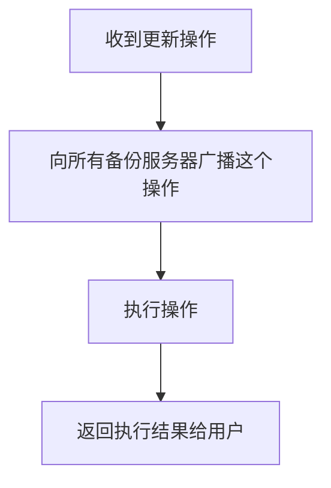
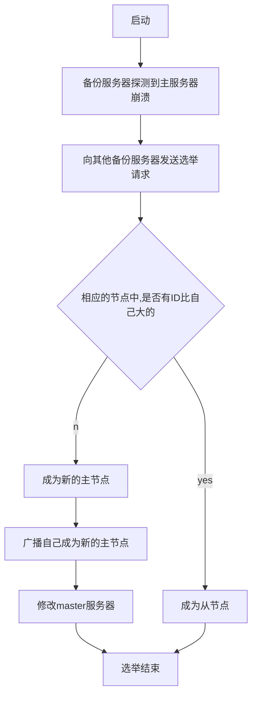
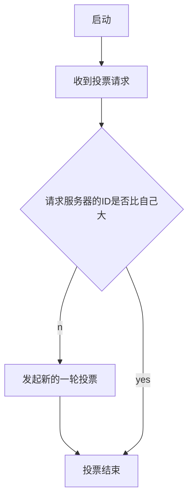

# 分布式的键值存储系统

## 题目要求

1. 必须分布式的键值存储系统，至少在两个节点或者两个进程中测试；
2. 可以是集中式的也可以是非集中式；
3. 能够完成基本的操作如：PUT、GET、DEL等；
4. 支持多用户同时操作；
5. 至少实现一种面向客户的一致性如单调写；
6. 需要完整的功能测试用例；
7. 涉及到节点通信时须采用RPC机制；
8. 提交源码和报告，压缩后命名方式为：学号\_姓名\_班别；

## 解决思路

### 系统架构

这个分布式的键值存储系统采用了类似GFS的架构，即有一个Master服务器，用于维护一张（Key，Chunk服务器）的映射表，同时记录了Chunk服务器的IP地址和端口；大量实际的工作由Chunk服务器完成，Chunk服务器里面存放着具体的键值对，每个Chunk服务器只存放一部分的键值对。系统架构[如下](#系统架构)


### 访问或更新

用户想要访问或更改某个K-ey对应的Value时，需要先访问Master服务器，获取存放该Key的Chunk服务器对应的地址，然后再去访问对应的Chunk服务器。当用户删除或插入键值对时，需要先修改Master服务器上的映射表，然后再去修改具体的Chunk服务器。

### 容错

键值对保存在Chunk服务器的内存上，每个一段时间会把所有数据输出到一个json文件里，以避免数据丢失并且方便重启时恢复数据。为了提高可用性和容错能力，每个服务器都可以由一个或多个备份服务器。每个服务器上都有一个用于检测其它服务器状态的线程。一旦检测到主服务器发生了崩溃，备份服务器之间可以通过Bully选举算法产生新的主服务器。

### 一致性

这个系统提供了单调写和读写一致性，实现原理是：当用户对某一个数据x进行写操作时，只有该操作传播到所有的副本后才返回。当多个用户（进程）同时对同一个数据项进行写操作时，使用锁实现写操作的互斥，确保每个时刻只有一个进程在对数据进行写。

### 功能

这个系统支持针对Key-Value对的操作由插入、删除、修改、访问。Value的支持类型由字符串、整数、浮点数、列表、字典。

## 实现细节

### 流程图

#### 用户访问、插入、删除、更新


#### 服务器收到更新操作

用户发起的更新操作都是发给主服务器的。




#### 备份服务器选举过程

当一个备份服务器检测到主服务器崩溃时，就会发起投票请求



当一个备份服务器收到其它备份服务器的投票请求时



### 代码

#### Master服务器

Master服务器维护着一个(Key, Chunk服务器)的映射表，以及Chunk服务器的IP和端口号，用户要访问具体的键值对时，要先访问Master服务器，才能知道要访问哪台Chunk服务器去获取键值对。Master服务器有两种，一种是primary，即主节点；另一种是secondary，即备份节点。

##### 初始化

Master服务器有两种，一种是主节点(primary)，一种是备份节点(secondary)。主节点除了维护映射表和记录chunk服务器的ip和端口的表之外，还记录了所有备份节点的id、ip和端口。主节点启动时，会判断是否存在数据文件，如果有数据文件，则可以从文件中恢复，避免数据丢失。备份节点启动时，会从主节点中拷贝把所有数据过来，以保持一致性，以后每次主节点更新时，更新操作都会广播到从节点。

```python
class MasterService(MasterServer_pb2_grpc.MasterServerServicer):
    def __init__(self, id, ip, port, role='primary', primary_ip=None, primary_port=None):
        self.id = id  # id
        self.ip = ip  # ip地址
        self.port = port  # 端口号
        self.role = role  # 判断是否是主节点
        # 如果是备份节点，这里记录在主节点的ip和端口
        self.primary_ip = primary_ip
        self.primary_port = primary_port
        # 如果是主节点，则记录自己的备份节点
        self.secondaries = {}
        self.directory_mutex = threading.Lock()  # 映射表锁，实现写互斥
        self.chunks_mutex = threading.Lock()  # chunk列表锁
        self.secondaries_mutex = threading.Lock()  # secondaries列表锁
        if self.role == 'primary':  # 如果是主节点，启动的时候会尝试从文件里读取已有数据
            if os.path.exists(settings.Directory_File):
                with open(settings.Directory_File, 'r') as file:
                    self.directory = json.load(file)
            else:
                self.directory = {}
            if os.path.exists(settings.Chunk_List_File):
                with open(settings.Chunk_List_File, 'r') as file:
                    self.chunks = json.load(file)
            else:
                self.chunks = {}  # key是节点id，value可以记录一些节点的信息，例如key数量等
        else:  # 备份节点启动
            self.chunks = {}
            self.directory = {}
            # 使用rpc调用，从主节点拷贝映射表以及chunk服务器的信息
            with grpc.insecure_channel('{}:{}'.format(self.primary_ip, self.primary_port)) as channel:
                stub = MasterServer_pb2_grpc.MasterServerStub(channel)
                response = stub.sync_chunks(MasterServer_pb2.Empty())
                for chunk in response:
                    self.chunks[chunk.id] = {'ip': chunk.ip, 'port': chunk.port, 'num_keys': chunk.num_keys, 'live': True}
                response = stub.sync_directory(MasterServer_pb2.Empty())
                for item in response:
                    self.directory[item.key] = item.chunk
                response = stub.add_secondary(MasterServer_pb2.Secondary(id=self.id, ip=self.ip, port=self.port))
                if response.code != 200:
                    print('error: {}'.format(response.msg))
                    exit(0)
    
    # 用于同步映射表的rpc调用
    def sync_directory(self, request, context):
        for key in self.directory:
            yield MasterServer_pb2.Directory(key=key, chunk=self.directory[key],msg='ok', code=200)

    # 用于同步chunk服务器信息的rpc调用
    def sync_chunks(self, request, context):
        for chunk in self.chunks:
            yield MasterServer_pb2.Chunk(id=chunk, ip=self.chunks[chunk]['ip'], port=self.chunks[chunk]['port'],num_keys=self.chunks[chunk]['num_keys'], msg='ok', code=200)
    
    # 添加备份节点的rpc调用
    def add_secondary(self, request, context):
        self.secondaries_mutex.acquire()
        if request.id in self.secondaries:
            self.secondaries_mutex.release()
            return MasterServer_pb2.Reply(msg='secondary node existed', code=400)
        self.secondaries[request.id] = {'ip': request.ip, 'port': request.port, 'live': True}
        self.secondaries_mutex.release()
        return MasterServer_pb2.Reply(msg=request.ip, code=200)
```

##### 查询

客户想要访问一个具体的键值对时，首先要使用Master服务器提供的rpc调用，获取键值对所在的Chunk服务器，具体实现如下

```python
    def get_chunk(self, request, context):
        if request.key in self.directory:
            chunk = self.directory[request.key]  # 获取存放该键值对的Chunk服务器的id
            return MasterServer_pb2.Chunk(id=chunk, ip=self.chunks[chunk]['ip'], port=self.chunks[chunk]['port'], msg='ok', code=200)
        else:
            return MasterServer_pb2.Chunk(msg='not found', code=404)
```

##### 插入和删除

用户要插入或者删除某个键值对时，首先要对Master服务器上的映射表进行修改，然后Master服务器返回存放该键值对的Chunk服务器地址，用户再去修改Chunk服务器。为了保持单调写，每次只允许一个线程去修改映射表，并且更新操作在所有备份节点上执行完后才返回给用户。插入具体实现如下

```python
    def insert_key(self, request, context):
        self.directory_mutex.acquire()  # 加锁实现互斥
        if request.key in self.directory:  # 判断键是否已经存在
            self.directory_mutex.release()
            return MasterServer_pb2.Chunk(msg='key existed', code=400)
        else:
            chunk = request.chunk
            if chunk == '':
                chunk = self._select_chunk()  # 选择一个Chunk服务器插入
                request.chunk = chunk
            if chunk:
                self.directory[request.key] = chunk
                self.chunks[chunk]['num_keys'] += 1
                self._update_secondaries('insert_key', request) # 把更新操作广播给所有备份节点
                self.directory_mutex.release()  # 释放锁
                return MasterServer_pb2.Chunk(id=chunk, ip=self.chunks[chunk]['ip'], port=self.chunks[chunk]['port'], code=200)
            else:
                self.directory_mutex.release()  # 释放锁
                return MasterServer_pb2.Chunk(msg='chunk is unavailable', code=500)

    def _update_secondaries(self, operation, *args, **kwargs):
        for secondary in list(self.secondaries.keys()):  # 把操作传给所有的备份节点
            try:
                with grpc.insecure_channel('{}:{}'.format(self.secondaries[secondary]['ip'], self.secondaries[secondary]['port'])) as channel:
                    stub = MasterServer_pb2_grpc.MasterServerStub(channel)
                    opt = getattr(stub, operation)
                    opt(*args, **kwargs)
            except Exception as e:  # 删除连接失败的备份节点
                print(e)
                del self.secondaries[secondary]
                
    # 随机选择一个插入的节点，这里可以加入一些启发式策略，以实现负债均衡。
    def _select_chunk(self):
        live = []
        for chunk in self.chunks:
            if self.chunks[chunk]['live']:
                live.append(chunk)
        if len(live) == 0:
            return None
        else:
            return random.choice(live)
```

这里要注意一个问题，主节点插入一个键值对时，是随机选一个Chunk服务器的，而备份节点也要插入相同的记录。删除操作也类似，就不一一赘述。

##### 容错

在Master服务器上的容错机制有定期把内存里的数据写到json文件了，这样重启的时候可以从文件中读取数据。

```python
    def _persistence(self):
        while True:
            with open(settings.Directory_File, 'w') as file:
                json.dump(self.directory, file)
            with open(settings.Chunk_List_File, 'w') as file:
                json.dump(self.chunks, file)
            with open(settings.Info_File, 'w') as file:
                info = {'id': self.id, 'ip': self.ip, 'port': self.port, 'role': self.role, 'primary_ip': self.primary_ip, 'primary_port': self.primary_port}
                json.dump(info, file)
            time.sleep(settings.Persistence_Time)
```

#### Chunk服务器

Chunk服务器完成大部分针对于键值对的操作。提供单调写和读写一致性。在容错方面，实现了如果主服务器失效的话，备份服务器就会通过选举产生新的主服务器。

##### 初始化

Chunk服务器的初始化和Master服务器的初始化类似，分为主节点和备份节点的启动。主节点启动时，会尝试从文件中读取已有的数据启动，而备份节点启动时，会从主节点拷贝数据。由于和Master服务器的初始化非常相似，这里就不一一展示了。

##### 查询

Chunk服务器查询也和Master服务器的查询类似，具体如下

```python
    def get_key(self, request, context):
        if request.key in self.table:
            return ChunkServer_pb2.Value(key=request.key, value=self.table[request.key]['value'], type=self.table[request.key]['type'], msg='ok', code=200)
        return ChunkServer_pb2.Value(msg='not found', code=404)
```

##### 插入、删除和修改

Chunk服务器插入、删除或修改一个键值对时，具体流程是：主节点收到请求，主节点执行操作，主节点广播操作给所有备份节点，返回给用户。更新操作在所有备份节点上执行后，才返回用户，这样可以保证单调写和读写一致性。已插入操作的具体代码如下

```python
    def insert_key(self, request, context):
        self.table_lock.acquire()  # 加锁，实现互斥
        if request.key in self.table:
            self.table_lock.release()  # 释放锁
            return ChunkServer_pb2.Reply(msg='key existed', code=400)
        self.table[request.key] = {'value': request.value, 'type': request.type}
        self._update_secondary('insert_key', request)  # 更新操作广播给自己的备份节点
        self.table_lock.release()  # 释放锁
        return ChunkServer_pb2.Reply(msg='ok', code=200)  # 返回用户
```

##### 容错

每个服务器上都有一个用于检测其它服务器状态的线程，在服务器启动的同时，该线程就启动了。

```python
    # 用于给其它节点测试自己的状态
    def heart(self, request, context):
        return ChunkServer_pb2.Reply(msg='I am chunk {}'.format(self.id), code=200)

    def _detect_heart(self):
        while True:
            # 检测同一个群组了，其它节点的状态
            for mate in list(self.mates.keys()):
                try:
                    with grpc.insecure_channel('{}:{}'.format(self.mates[mate]['ip'], self.mates[mate]['port'])) as channel:
                        stub = ChunkServer_pb2_grpc.ChunkServerStub(channel)
                        # 检测心跳
                        response = stub.heart(ChunkServer_pb2.Empty())
                        if response.code != 200:
                            del self.mates[mate]
                except Exception as e:
                    print(e)
                    del self.mates[mate]
            if self.role != 'primary':  # 检测主节点的状态
                try:
                    with grpc.insecure_channel('{}:{}'.format(self.primary_ip, self.primary_port)) as channel:
                        stub = ChunkServer_pb2_grpc.ChunkServerStub(channel)
                        response = stub.heart(ChunkServer_pb2.Empty())
                        if response.code != 200:  # 一旦发现主节点失效，就使用Bully算法选出新的主节点
                            self._select() 
                except Exception as e:
                    print('error: {}'.format(e))
                    self._select()  # 一旦发现主节点失效，就使用Bully算法选出新的主节点
            time.sleep(settings.Detect_Heart_Time)
```

备份一旦发现主节点失效，就使用Bully算法选出新的主节点。一个节点发起选举时，就会先其它所有备份节点广播投票请求；其它节点收到请求后，如果发起节点的id比自己的id大，则投赞成票，否则，投反对票，并且自己发起新的选举；如果节点收到反对票，则停止其发起的选举；如果节点收到的都是赞成票，则成为新的主节点，并广播选举结果，此外，新的主节点还要把投票结果告诉Master服务器，让其更新记录。选举过程如下

```python
    def _select(self):
        primary_id = self.id
        for mate in self.mates:  # 向所有节点广播选举请求
            with grpc.insecure_channel('{}:{}'.format(self.mates[mate]['ip'], self.mates[mate]['port'])) as channel:
                stub = ChunkServer_pb2_grpc.ChunkServerStub(channel)
                # 发出选举请求
                response = stub.select_primary(ChunkServer_pb2.Secondary(id=self.id, ip=self.ip, port=self.port))
                if response.id != self.id:  # 收到反对票，则终止选举
                    primary_id = response.id
                    break
        if primary_id == self.id:  # 如果收到的都时赞成票，则成为新的主节点
            self.role = 'primary'
            for mate in self.mates:  # 广播投票结果
                with grpc.insecure_channel('{}:{}'.format(self.mates[mate]['ip'], self.mates[mate]['port'])) as channel:
                    stub = ChunkServer_pb2_grpc.ChunkServerStub(channel)
                    stub.replace_primary(ChunkServer_pb2.Primary(id=self.id, ip=self.ip, port=self.port))
			# 告知Master服务器选举结果。
            with grpc.insecure_channel('{}:{}'.format(self.master_ip, self.master_port)) as channel:
                stub = MasterServer_pb2_grpc.MasterServerStub(channel)
                stub.replace_chunk(
MasterServer_pb2.Replace(old_chunk=MasterServer_pb2.Chunk(id=self.primary_id, ip=self.primary_ip,port=self.primary_port),new_chunk=MasterServer_pb2.Chunk(id=self.id, ip=self.ip, port=self.port,num_keys=len(self.table))))
```

#### 客户端

客户端提供的操作有插入(put)、删除(delete)、修改(update)、查询(get)，这些功能封装到一个package里，使用的时候可以直接调用。例子[如下](#客户端)

```python
import sys

sys.path.append('./ChunkServer')
sys.path.append('./MasterServer')
from Client.client import KeyValueClient

if __name__ == '__main__':
    client = KeyValueClient('127.0.0.1', '5000')  # 创建一个实例，参数分别时主服务器的ip和端口
    client.connect()  # 连接
    client.put('a', 1)  # 插入
    client.put('b', 2)
    client.put('c', 3)
    a = client.get('a')  # 查询
    print(a)
    client.update('a', [1, 2, 34])  # 更新
    a = client.get('a')
    print(a)
    # client.delete('a')
```

#### 功能测试

此次测试的系统架构如[上图](#系统架构)所示。

##### 启动Master服务器

进入到MasterServer目录里，参数分别是id、ip、端口号

```shell
python server.py 1 127.0.0.1 5000
```

启动Master服务器的备份节点，加上-s选项，-i是主节点的ip，-p是主节点的端口

```shell
python server.py 2 127.0.0.1 5001 -s -i 127.0.0.1 -p 5000
```

##### 启动Chunk服务器

进入到ChunkServer目录里，参数分别是id、ip、端口号、Master服务器的ip、Master服务器的端口号

```shell
python server.py 3 127.0.0.1 5002 127.0.0.1 5000
```

启动Chunk服务器的备份节点，加上-s选项，-i是主节点的ip，-p是主节点的端口，-d是主节点的id

```shell
python server.py 4 127.0.0.1 5003 127.0.0.1 5000 -s -d 3 -i 127.0.0.1 -p 5002
```

##### 运行客户端

客户端代码[如上](#客户端)

```python
python test.py
```

结果如下


此时，查看主Master服务器的directory.json文件，里面存放着整个映射表：


说明a、b是存放在6号Chunk服务器上，c存放在3号Chunk服务器上。

再查看备份Master服务器的directory.json文件，可以看到，和主Master服务器完全一致。


再分别查看3号和6号服务器的table.json文件，里面分别存放着具体的键值对

3号


6号


可见，数据和Master服务器上的记录是一致的。

此时运行程序

```python
import sys

sys.path.append('./ChunkServer')
sys.path.append('./MasterServer')
from Client.client import KeyValueClient

if __name__ == '__main__':
    client = KeyValueClient('127.0.0.1', '5000')
    client.connect()
    client.delete('a')
```

再次查看Master服务器的directory.json文件，发现a项已经删除


查看6号服务器，发现a项已经删除


##### 故障恢复

此时，强行关闭3号服务器，过一段事件之后，查看Master服务器的directory.json文件


可以看到，原本的3号服务器被其备份5号服务器给取代了，再尝试运行下面程序

```python
import sys

sys.path.append('./ChunkServer')
sys.path.append('./MasterServer')
from Client.client import KeyValueClient

if __name__ == '__main__':
    client = KeyValueClient('127.0.0.1', '5000')
    client.connect()
    c = client.get('c')
    print(c)
```

结果为


可见，数据没有丢失，系统仍然正常工作。

### 遇到的问题

在这次项目中，困扰我比较久的问题就是如何实现一个面向用户的一致性。最终选择了较为简单的单调写，实现方案就是让写操作在所有备份节点上完成之后才返回给用户，并且用户在等待返回时，是阻塞的。还有就是在多进程的环境下，查找Bug的难度大大增加，为了更快地定位错误在哪里，我在每个每个rpc调用的返回里都加入了类似http的状态码。

### 总结

通过这次实验，我对分布式系统以及grpc的使用有了进一步的认识。之前一直觉得单调读、单调写等一致性模型很抽象，难以理解，经过这次项目，自己实现了一个一致性模型，对这些的概念掌握得就更加牢固了。